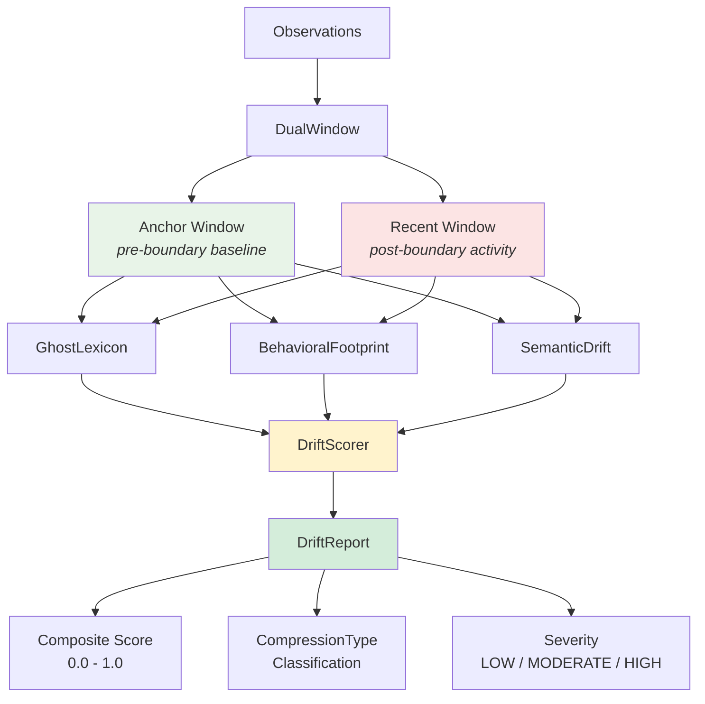
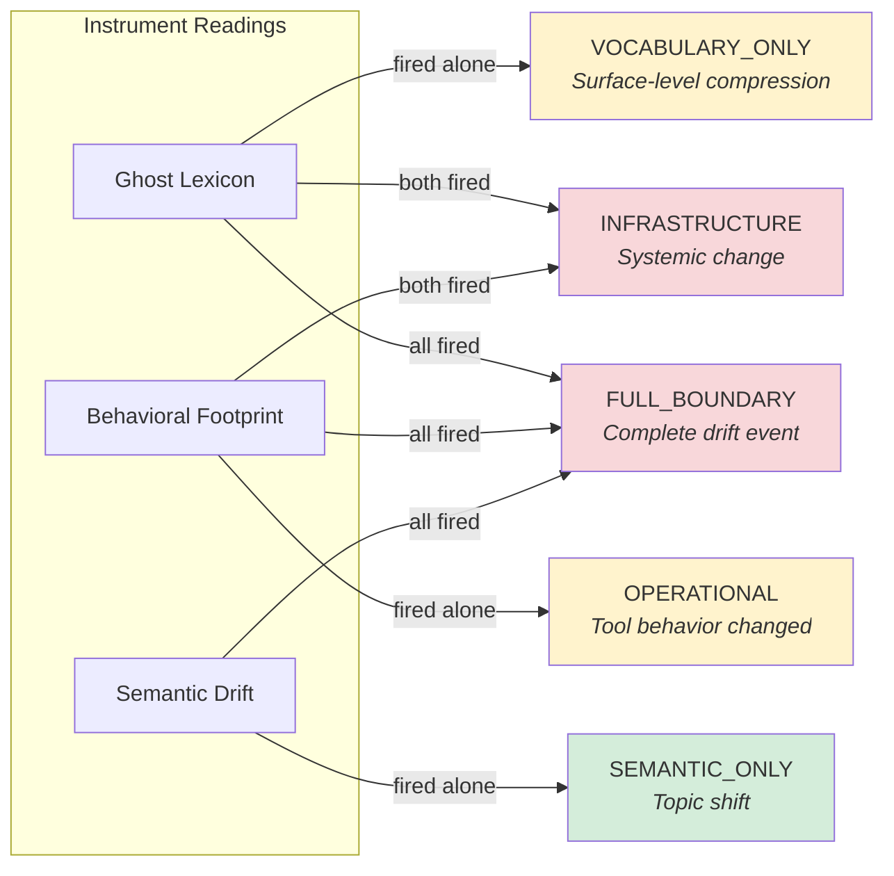
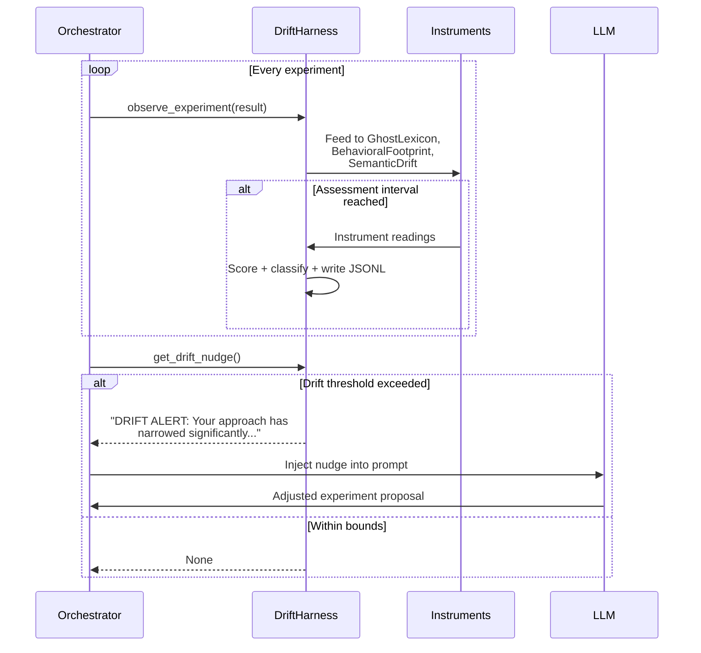

# drift-monitor

[](https://www.python.org/downloads/)
[](LICENSE)
[](#installation)

**Behavioral drift detection for AI agents across context compression boundaries.**

When an AI agent's context fills up and gets compressed (summarized, truncated, or window-shifted), it can silently lose specialized vocabulary, shift tool-call preferences, or narrow its conceptual framing. drift-monitor detects these changes using three complementary instruments and provides actionable nudges to course-correct.

Methodology inspired by [morrow.run's compression-monitor](https://morrow.run) (v0.2.1, MIT License). This is an independent implementation -- no code was copied from the original.

## Architecture



## Quick Start

```bash
pip install git+https://github.com/elementalcollision/drift-monitor.git
```

```python
from drift_monitor import GhostLexicon, BehavioralFootprint, SemanticDrift, DriftScorer

scorer = DriftScorer()

# Feed pre-compression observations (anchor window)
for text in pre_compression_outputs:
    scorer.observe(text, metadata={"tools_used": ["search", "code"]})

scorer.mark_boundary()  # Context was compressed here

# Feed post-compression observations (recent window)
for text in post_compression_outputs:
    scorer.observe(text, metadata={"tools_used": ["search"]})

report = scorer.score()
print(f"Drift: {report.composite:.3f} ({report.compression_type.name})")
# Drift: 0.467 (FULL_BOUNDARY)
```

## Instruments

### Ghost Lexicon

Detects loss of low-frequency, high-precision vocabulary after compression. When an agent loses access to specialized terms like "idempotent", "memoization", or "eigendecomposition" and starts using generic alternatives, Ghost Lexicon catches it.

**How it works:** Extracts specialized vocabulary (terms with `min_freq >= 2`, `min_length >= 4`, excluding stop words) from the anchor window, then measures what fraction disappeared from recent output.

| Score | Interpretation |
|-------|---------------|
| 0.0   | All specialized terms retained |
| 0.5   | Half of specialized vocabulary lost |
| 1.0   | Complete vocabulary collapse |

### Behavioral Footprint

Tracks shifts in tool-call ratios and response shape. If an agent was using `search`, `code`, and `analyze` tools evenly but post-compression only uses `search`, that's behavioral drift.

**How it works:** Computes a weighted combination of tool distribution distance (total variation, weight 0.6) and response length change (normalized delta, weight 0.4).

### Semantic Drift

Measures movement of the conceptual center-of-gravity. Detects when an agent's focus shifts from, say, "architecture exploration" to "learning rate tunneling."

**How it works:** Keyword-overlap cosine similarity (zero-dependency fallback) or centroid distance via `sentence-transformers` embeddings (optional).

```bash
# Enable embedding-based semantic drift (more sensitive)
pip install drift-monitor[embeddings]
```

## Compression Type Classification

Which instruments fire -- and in what combination -- reveals the type of drift:



| Type | Instruments Fired | Meaning |
|------|------------------|---------|
| `NONE` | None | No drift detected |
| `VOCABULARY_ONLY` | Ghost Lexicon only | Surface compression, behavior intact |
| `OPERATIONAL` | Behavioral only | Tool preferences shifted |
| `SEMANTIC_ONLY` | Semantic only | Topic changed, vocabulary intact |
| `INFRASTRUCTURE` | Ghost Lexicon + Behavioral | Systemic context loss |
| `FULL_BOUNDARY` | All three | Major compression boundary crossed |

## Scoring

The composite score is a weighted average of all three instruments:

| Instrument | Default Weight |
|-----------|---------------|
| Ghost Lexicon | 0.35 |
| Behavioral Footprint | 0.35 |
| Semantic Drift | 0.30 |

Weights are configurable:

```python
scorer = DriftScorer(weights={
    "ghost_lexicon": 0.5,
    "behavioral_footprint": 0.3,
    "semantic_drift": 0.2,
})
```

## Harness Integration

For live experiment loops (like autonomous hyperparameter optimization), the `DriftHarness` provides plug-and-play monitoring with an actionable nudge system.



### Usage

```python
from drift_monitor.harness import DriftHarness, DriftConfig

config = DriftConfig(
    anchor_window=25,          # First 25 experiments form the baseline
    assessment_interval=10,    # Assess drift every 10 experiments
    ghost_nudge_threshold=0.35,
    behavioral_nudge_threshold=0.30,
    composite_nudge_threshold=0.30,
)

harness = DriftHarness(results_dir="./results", config=config)

# In your experiment loop:
for experiment in run_experiments():
    harness.observe_experiment(experiment)

    nudge = harness.get_drift_nudge()
    if nudge:
        # Inject into LLM prompt to course-correct
        prompt += nudge
```

### Nudge System

Three tiers of nudges fire based on which thresholds are exceeded:

| Tier | Trigger | Example |
|------|---------|---------|
| **Vocabulary** | Ghost Lexicon > 0.35 | "Lost vocabulary suggests your exploration has narrowed. Consider revisiting: {lost_terms}" |
| **Behavioral** | Behavioral > 0.30 | "Tool usage has shifted significantly. The dominant strategy ({category}) may be exhausting its returns." |
| **Composite** | Composite > 0.30 | "Full behavioral drift detected. Your approach has narrowed significantly since the start of this run." |

Nudges include **strategy-specific suggestions** based on the detected experiment category (learning_rate, architecture, schedule, regularization, batch_size).

## CLI

```bash
# Run all instruments on pre/post JSONL files
drift-monitor run --pre anchor.jsonl --post recent.jsonl

# Individual instruments
drift-monitor ghost-lexicon --pre anchor.jsonl --post recent.jsonl
drift-monitor behavioral --pre anchor.jsonl --post recent.jsonl
drift-monitor semantic --pre anchor.jsonl --post recent.jsonl

# Interactive demo with synthetic data
drift-monitor demo

# Validate detection rates against synthetic drift
drift-monitor validate --trials 50
```

### Validation Results

The `validate` command runs synthetic drift across all modes and reports detection rates:

| Drift Mode | Detection Rate | Notes |
|-----------|---------------|-------|
| VOCABULARY | 100% | Specialized term replacement |
| TOPIC | 100% | Complete domain shift |
| TOOLCALL | 100% | Tool distribution change |
| COMBINED | 100% | All modes simultaneously |
| FRAMING | 0% | Intentionally undetectable (same vocab, different framing) |

The 0% detection on FRAMING drift is by design -- it validates that the instruments don't produce false positives on subtle reframing that preserves vocabulary and tool usage.

## JSONL Output Format

Drift readings are written as newline-delimited JSON:

```json
{
  "experiment_count": 30,
  "composite_score": 0.467,
  "compression_type": "full_boundary",
  "ghost_lexicon": {"score": 0.778, "severity": "high", "lost_terms": ["architecture", "attention"]},
  "behavioral_footprint": {"score": 0.285, "severity": "moderate"},
  "semantic_drift": {"score": 0.316, "severity": "high"},
  "strategy_distribution": {"learning_rate": 0.6, "regularization": 0.4},
  "timestamp": "2026-04-04T22:51:46Z"
}
```

## Related Projects

### [autoresearch-unified](https://github.com/elementalcollision/autoresearch-unified)

Autonomous LLM-driven GPU pretraining research across NVIDIA, AMD, Intel, and Apple platforms. Claude proposes hyperparameter changes, trains a GPT-2-scale model for 5 minutes, evaluates, and iterates -- hundreds of experiments per run.

drift-monitor is integrated as an **optional enhancement** ([PR #53](https://github.com/elementalcollision/autoresearch-unified/pull/53)) that replaces the built-in stagnation heuristic with multi-instrument drift analysis. When installed, it detects when the LLM gets stuck in strategy tunnels (e.g., only tweaking learning rates) and injects actionable nudges to broaden exploration.

```
pip install -e ".[drift]"  # Enables drift monitoring in autoresearch
```

### [Benchwright](https://benchwright.polsia.app/)

Production LLM monitoring and benchmarking platform. While drift-monitor operates at the **experiment/research level** (detecting behavioral drift during HP optimization runs), Benchwright operates at the **production level** -- continuously evaluating deployed models, detecting regressions, and benchmarking alternatives.

Together they cover the full lifecycle: drift-monitor ensures research experiments don't stagnate, Benchwright ensures production deployments don't regress.

## Installation

```bash
# From GitHub
pip install git+https://github.com/elementalcollision/drift-monitor.git

# With optional embedding support
pip install "drift-monitor[embeddings] @ git+https://github.com/elementalcollision/drift-monitor.git"

# Development
git clone https://github.com/elementalcollision/drift-monitor.git
cd drift-monitor
pip install -e ".[dev]"
pytest tests/ -v  # 60 tests
```

**Requirements:** Python 3.9+ | Zero required dependencies | Optional: `sentence-transformers` for embedding-based semantic drift

## Attribution

This project's methodology is inspired by [morrow.run's compression-monitor](https://morrow.run) (v0.2.1, MIT License). drift-monitor is an independent implementation -- no code was copied from the original. The key insight adopted from compression-monitor is that *which instruments fire and in what combination* reveals the type and severity of context compression, not just that drift occurred.

## License

[MIT](LICENSE)
